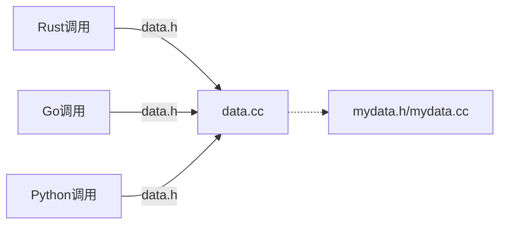

# call-cpp-dylib

Rust, Go, Python调用C++





示例代码结构说明

```
.
├── build.rs     # 在运行rust之前静默编译C++动态
├── Cargo.lock
├── Cargo.toml
├── CMakeLists.txt  # cmake文件，用于编译C++动态库
├── data.cc       # 中间层, 隐藏mydata的细节。其他语言调用者不需要这个实现文件
├── data.h        # 导出的头文件, 提供给其他语言调用者使用，这也是唯一一个对外提供的文件
├── go.mod       # go的包管理
├── LICENSE
├── main.cc      # C++直接调用示例
├── main.go     # go 调用示例
├── main.py     # Python调用示例
├── Makefile
├── mydata.cc    # C++的文件，真正的细节实现，通过 data.h 和 data.cc 封装了一层，将mydata隐藏在背后。其他语言调用者不需要这个实现文件
├── mydata.h     # 不对外提供，在data.cc用到，其他语言调用者不需要这个实现文件
├── README.md
└── src
    └── main.rs   # rust调用示例
```


## 运行示例

需要安装 `make, cmake, gcc, g++, python, rust, go, python3`


## 运行


```shell
# 运行 rust调用示例
make rust

# 运行 go调用示例
make go

# 运行 python调用示例
make python

```

